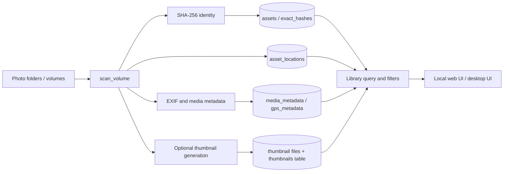
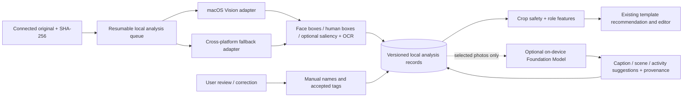

# Local Vision / AI Architecture Investigation

Date: 2026-09-24
Scope: architecture investigation plus the explicitly authorized, local-only
Vision geometry POC. No catalog migration, persistent analysis, server route or
runtime setting was added.

## Executive conclusion

**Yes — native macOS Vision can materially improve the unfinished collage crop
work, but the useful first feature is local face/person-region detection, not
Apple Photos' People search and not an LLM.** The collage code already knows
how to use normalized face boxes to protect a crop, but the current Creator
Mode photo-loading path does not provide those boxes. The only live detector
found is an optional OpenCV Haar detector in the older collage-candidate POC;
it is not Apple's Vision framework and is not connected to the current
Creator Mode's A4 template generation.

Apple's Photos app does provide People & Pets search and on-device grouping in
its own library. The public PhotoKit surface reviewed here does not expose
those internal face clusters or the face rectangles for arbitrary folders
indexed by Photo Manager. Treat Photos.app's People collection as a useful
user-facing reference, not as a dependable integration API.

For the immediate crop problem, the smallest valuable addition is a native
Vision adapter which returns normalized face boxes and full-person boxes,
then persists versioned observations locally and supplies them to the existing
crop/template inputs. Keep same-person clustering and naming out of that first
milestone. Face detection answers “where is a face?”, not “who is this?”

## 1. Current architecture and data flow

### Catalog and library path

Original media remains in user folders or removable volumes. The catalog
assigns a stable logical `asset_id`; byte-identical files are linked through
SHA-256 identity. Capture date, camera, dimensions, EXIF orientation, GPS,
ratings and keywords are extracted into SQLite. Thumbnails are derived cache
files; originals are not modified.



Verified entry points include `src/photovault/catalog/scanner.py`,
`src/photovault/catalog/metadata.py`, `src/photovault/catalog/thumbnails.py`,
`src/photovault/catalog/thumbnail_jobs.py`,
`src/photovault/catalog/library.py`, and
`src/photovault/database/migrations.py`.

### Current visual analysis and collage paths

There are two distinct collage paths. The older experimental candidate job
loads original assets, calls `analyse_photo()`, caches its result in
`collage-analysis-cache.json`, then sends the `PhotoInput` objects through
candidate providers and crop evaluation. The Creator Mode workflow loads
catalog rows through `/api/collage/photos`, generates editable template
documents, and opens them in the Fabric editor. That catalog response contains
ordinary library metadata but no face or body coordinates. The Creator Mode
path does not read the experimental cache.

```mermaid
flowchart TD
  subgraph ExistingCandidatePOC[Experimental candidate-generation path]
    SEL[Selected asset IDs] --> JOB[Background collage job]
    JOB --> ORIG[Read connected originals]
    ORIG --> OA[OpenCV Haar analyse_photo, if optional extra installed]
    OA --> CACHE[JSON analysis cache<br/>path + size + modified_ns]
    CACHE --> CROP[optimise_cell / crop metadata]
    CROP --> PROVIDER[Native / BSP / CEWE candidates]
    PROVIDER --> RENDER[Preview render]
  end
  subgraph CreatorMode[Current Creator Mode / A4 workflow]
    TOPIC[Topic or section asset IDs] --> API[/api/collage/photos]
    API --> ROWS[Catalog photo rows<br/>no analysis boxes]
    ROWS --> TEMPLATE[Template family / make_document]
    TEMPLATE --> EDITOR[Editable Fabric document]
    TEMPLATE --> NOFACE[Face / saliency marked unavailable in package manifest]
  end
  CACHE -. not connected .-> TEMPLATE
```

The network/browser boundary matters: `/api/collage/photos` uses
`library_payload()`, and the current row serializer does not include derived
face geometry. That omission explains why the new template library's optional
`analysis.faces` and `analysis.subjects` inputs are empty in normal Creator
Mode use. The template code can consume such boxes and calculate protected
crop plans when they are provided, but it cannot infer them from a filename,
tag, or the catalog's current person membership.

## 2. Existing visual-intelligence capability audit

Status is judged by whether a capability runs in a normal catalog or Creator
Mode path, not by whether a type, test fixture, or design note exists.

| Capability | Current status | Evidence / practical limitation |
|---|---|---|
| EXIF, dimensions, orientation, GPS | Implemented and used | Scanner/metadata path; GPS is catalogued separately. |
| Exact duplicate identity | Implemented and active | SHA-256 `exact_hashes`; exact byte equality only. |
| Near-duplicate image similarity | Implemented | Local dHash/pHash and advisory duplicate groups; not identity or deletion evidence. |
| Image categories | Implemented but optional | User-supplied ONNX model + labels; cached by model and source hash, with GUI background worker. No model weights are bundled/downloaded. |
| Semantic image embeddings | Implemented but optional | User-supplied ONNX image encoder; vectors persist per asset/model and cosine search is available. The smoke test is plumbing-only, not a quality benchmark. |
| People records/search | Partial | Manual create/rename/assign works. A JSON import path can import previously generated per-run memberships, but this repository does not generate those Vision groups itself. |
| Face rectangles | Experimental / disconnected | `LocalFaceDetector` uses optional OpenCV Haar in `collage/analysis.py`; it sets a fixed `0.85` confidence rather than a calibrated detector score. Only the experimental candidate job calls it. |
| Face landmarks | Not used in application paths | No production Vision landmarks request or stored landmarks found. |
| Same-person recognition | Not implemented in active repo | `FaceEngine` is a protocol and the default implementation is `UnavailableFaceEngine`. The optional `FaceObservation.embedding` is only a contract field. |
| Full-body/person boxes | Not implemented in current analyzer | No human-rectangle detector in the active Photo Manager analysis path. |
| Saliency | Placeholder only in POC model | `PhotoAnalysis.salient_region` defaults to a central rectangle; no Vision/OpenCV saliency request calculates it. Crop scoring can read the field but is not receiving measured saliency. |
| Object/scene understanding | Partial | Generic optional image classification exists; no active scene/event-description pipeline. User topics, places and tags are catalog organization, not visual recognition. |
| OCR | Not implemented in the catalog/collage pipeline | No extracted text store or indexing path found. |
| Apple Vision / Foundation Models | Not integrated | Current Vision-like face extraction is OpenCV; no live Foundation Models integration found. Historical documents reference a Swift extractor, but the corresponding source is absent from this checkout. |
| Creator Mode face-safe crop | Not supplied today | JS template code accepts face/subject boxes; `/api/collage/photos` and topic-generated asset rows do not return them. Recent rendered-page diagnostics report `faceMetadataCount: 0`. |

Related code: `src/photovault/collage/analysis.py`,
`src/photovault/collage/crop.py`, `src/photovault/catalog/people.py`,
`src/photovault/catalog/people_import.py`,
`src/photovault/catalog/classification.py`,
`src/photovault/catalog/semantic.py`, and
`src/photovault/web/static/collage_template_library.js`.

The current 72-page rendered-template quality evidence contains zero pages'
face-analysis coverage (`faceMetadataCount: 0` on every recorded page). Its
crop-retention warnings measure geometric retention, not detected-face
failures. The report text in `docs/collage-template-library.md` says 215 crop
warnings, while the stored aggregate render report counted 205; that separate
documentation mismatch should be reconciled before publishing that quality
report.

## 3. What Apple's current APIs can and cannot do

Research checked Apple Developer documentation and Apple Support current as
of 2026-09-24. API availability should still be compiled and tested against
the app's chosen minimum macOS deployment target.

### Vision: deterministic geometric observations

- Face rectangles: `VNDetectFaceRectanglesRequest` / the newer
  `DetectFaceRectanglesRequest` returns face rectangles. Face landmarks are a
  separate request. These are suitable for normalized crop-protection boxes.
- Human rectangles: `VNDetectHumanRectanglesRequest` returns full- or
  upper-body regions. This is important for the user's “show the whole body”
  use case; a face box alone cannot keep a person's body in frame.
- Saliency: attention saliency and objectness saliency answer different
  questions. Attention maps approximate where a viewer may look; objectness
  highlights foreground objects. These are useful crop candidates, not
  semantic labels or a guarantee of a good editorial crop. Apple's own
  cropping guide notes that an empty attention map can resolve to the center.
- Instance masks: foreground/person segmentation can capture a subject shape
  better than a rectangle, especially where a tight crop intersects a person.
  This is more expensive and should be selective (for hero candidates), not a
  mandatory full-library step.
- OCR: Vision can return recognized text and its locations. Use it for signs,
  plaques, menus, labels or documents when relevant; avoid running it on every
  image by default.
- Classification and image feature prints: useful for labels and whole-image
  similarity. Apple's general image feature print is not documented as a
  dedicated face-identity embedding; it must not be treated as proof that two
  face crops are the same person.
- Object tracking requests track a previously detected region across an
  image/video sequence. That is different from identity matching among
  unrelated still photographs.

### People & Pets in Apple's Photos app

Apple Photos on Mac provides a People & Pets collection, names, merging and
grouping; Apple says it uses on-device technology for groups. Those are
valuable examples of the end-user experience. Photo Manager scans ordinary
folders/removable volumes into its own SQLite catalog, however, and does not
currently use PhotoKit as its catalog. The public PhotoKit documentation
reviewed did not expose Apple's internal face-group IDs/face boxes for those
external catalog assets. Do not scrape Photos' private databases or assume
Apple's UI groups can be imported as a supported API.

### Foundation Models and Core ML

Foundation Models can add natural-language or multimodal interpretation:
scene captions, tentative activity/semantic tags, structured summaries and
text interpretation from image content. It should consume image data and/or
Vision facts only when the user requests deeper enrichment. It is not a
replacement for the detector that must return stable pixel geometry, and its
descriptions/counts should be labelled as model inferences with confidence or
review state.

As of Apple's macOS 27 documentation, the framework supports multimodal image
prompts and Vision OCR/barcode tools. Apple documents Apple Intelligence on
Macs with M1 or later, subject to OS, supported language/region, feature
availability and model readiness. Its on-device model may need several GB of
local storage. Foundation Models also supports cloud/provider configurations;
using the framework alone is not a guarantee that a workflow stays local.
Strict-local operation must explicitly select the on-device system model and
must not call Private Cloud Compute or another provider.

Core ML runs local models and can use CPU/GPU/Neural Engine. That is a suitable
portable model boundary for custom categories/embeddings, but models and
licenses must be selected and validated. Existing ONNX support already gives
Photo Manager a model-pluggable path; native Vision is the highest-value Mac
addition for geometry, not a reason to replace the app's entire Python stack.

## 4. Face/person distinctions and recommended data model

These are three different product facts:

1. **Face present:** detector observation, rectangle, detector revision and
   confidence. No name or identity claim.
2. **Likely same person:** a cluster hypothesis derived from some face
   representation or an explicitly imported Apple Photos result. Needs
   conservative matching, a review/merge/split UI, and a clear model/provenance.
3. **Named person:** a user-assigned label such as “Mum” or “Charles”. Never
   infer a real-world name solely from an image model.

No public Apple Vision API reviewed supplies reliable, general-purpose
cross-photo face identity. Apple Photos does group people inside its own app,
but that is not a supported Photo Manager bridge. If same-person clustering is
later desired, use a dedicated local face-embedding model or a separately
approved data source, treat clusters as suggestions, and require user review.
Avoid retaining face embeddings in the first crop-safety milestone.

Conceptual persistence (not a schema change in this task):

- `asset_analysis`: asset ID, source SHA-256, engine, model/request revision,
  analysis version, orientation/coordinate space, status, elapsed time and
  analyzed timestamp.
- `face_observations`: analysis ID, normalized bounds, confidence, optional
  landmarks only if a product feature needs them.
- `subject_observations`: full-person/upper-body/foreground kind, normalized
  bounds or mask reference, confidence and detector provenance.
- `photo_understanding`: separate versioned semantic labels, caption, OCR and
  provenance; do not conflate them with user tags or manual person names.
- Future `person_clusters` and membership hypotheses should be distinct from
  manually labelled `people`; retain merge/split corrections and never
  silently rewrite a user's names.

The catalog already has useful patterns: `image_categories` and `embeddings`
store model name, source SHA-256 and computed time. `people` and
`person_members` can preserve manually named membership but currently store
only a face count per asset, not per-face geometry, observation provenance,
detector/model revision or cluster confidence.

## 5. Collage integration opportunities

The existing crop/template layer already has explicit seams:

- `collage_template_library.js` consumes optional `analysis.faces`,
  `analysis.subjects`, EXIF orientation, focus and semantic tags.
- It derives protected boxes, group-portrait flags, role suitability and crop
  diagnostics from those inputs.
- `collage/crop.py::optimise_cell()` shifts a cover crop toward the union of
  detected faces and reports excluded/partial faces.
- The A4 template chooser uses aspect ratio, crop retention, dimensions,
  favourites/ratings, chronology and semantic roles; it currently cannot
  decide that a person is visibly small or that a building/flower is the
  actual subject from the raw photo.

Vision would therefore improve crop safety, people-vs-detail slot selection,
group-photo protection, portrait/landscape fit and identifying small faces in
a hero slot. Human rectangles matter for whole-body crops; face boxes remain
useful at small scales. Saliency/foreground masks may improve hero focus after
the basic detector is measured.

Vision alone should not choose the story hero or claim a section theme. Hero
selection also depends on editorial choices, repeated scenes, image quality,
sequence and the user's preferred people. Semantic scene tags can help
recommend candidates, but all photos must remain assigned exactly once and
the user must keep final control. No template geometry or workflow redesign is
required to feed this metadata into the existing framework.

## 6. Proposed staged architecture



Remaining staged work after the POC:

1. **POC — native detection only (implemented, limited):** the opt-in
   `photovault vision-poc` command runs Apple's Vision face-rectangle and
   full-person-rectangle requests for at most 200 explicitly supplied local
   images. It emits normalized boxes, oriented dimensions, EXIF orientation,
   request revisions, confidence and per-image timing. It does not modify the
   catalog or media and creates no identity records. Before promotion, run it on
   a hand-checked sample of 100–300 photos and compare detections with examples
   and the older OpenCV Haar path.
2. **Crop bridge:** feed accepted observations to the current template input
   in memory and render before/after examples from the exact troublesome
   family/group photos. Validate face and full-body retention manually before
   choosing default thresholds.
3. **Durable incremental cache:** persist per-asset observations with SHA-256,
   engine/request revision, analysis schema version and coordinate space. Add
   resumable background jobs, cancellation, progress and “not analyzed / no
   observation / failed” states. Reanalyze only when source bytes or detector
   version changes.
4. **Safe UI surfacing:** show detected boxes/confidence in an opt-in inspector;
   let users correct a crop. Avoid turning detections into named people.
5. **Optional semantic pass:** add on-device Foundation Model summaries/tags
   for selected assets or topic sections only, with structured output,
   source/provenance and explicit local-model availability checks. A no-model
   path remains fully usable.
6. **Later, separately approved:** evaluate face-cluster suggestions only if
   people search has enough product value to justify biometric-like derived
   data, review UX and retention controls.

## 7. Performance and cache implications

- Do not run a Foundation Model over every image at every collage refresh. Run
  cheap metadata first, then deterministic Vision analysis in a resumable
  worker, and invoke semantic interpretation only for a topic/selection where
  it helps.
- Cache by content hash plus detector/model revision and preprocessing
  version. The legacy candidate-generation experiment's JSON cache checks
  absolute path, size and mtime; that is useful for a disposable run, but the
  existing catalog SHA-256 is a stronger long-lived content key and protects
  against same-size/same-time file replacement. The new Vision POC is
  intentionally uncached.
- Analyze a downsampled image for normal box detection, retain the scale/EXIF
  transform, and map results back to normalized original coordinates. Benchmark
  a higher-resolution retry only when tiny faces or low-confidence boxes are
  likely to affect a selected collage.
- Keep masks/landmark arrays out of the general catalog unless a measured
  feature requires them. Rectangles plus provenance are compact; large
  pixel-level masks should be separate disposable cache entries.
- Use one worker queue and a bounded decode/concurrency policy. Measure
  throughput, peak memory, cancellation behavior and disk growth on this Mac;
  this repository contains no representative Vision benchmark, so no
  milliseconds-per-photo claim is made here.
- Vision may exploit Apple silicon locally; do not assume every API uses the
  Neural Engine or has identical speed/accuracy across OS revisions. Record
  the actual request revision and benchmark the target machines.
- A non-representative smoke test on this Mac (macOS 26.6.2) ran both requests
  on the built-in 3840 × 2160 desktop wallpaper in CPU mode in about 0.19 s of
  Vision processing; it correctly emitted no observations for that scenery.
  This is only a successful runtime/format check, not a face-detection accuracy
  or library-throughput benchmark. The restricted agent sandbox blocked
  CoreVideo/Vision execution, while the same read-only command succeeded in a
  normal local process.

## 8. Privacy, security and compatibility

- `Vision` and Core ML inference can be performed locally without uploading
  source photos. Foundation Models needs an explicit on-device system model
  selection for the same guarantee; Cloud/PCC and third-party providers must
  be disabled for a local-only mode.
- Photo Manager's normal catalog is cross-platform and its browser service can
  be used from other devices. Face coordinates, face crops and embeddings are
  sensitive derived information. Do not append them to the general-purpose
  `/api/collage/photos` response if that endpoint is reachable over LAN.
  Prefer a narrow, authorized editor-analysis endpoint or local-only access;
  document whether a trusted LAN client can see it before enabling it.
- Keep source photos read-only. Provide an “analyze photos” opt-in, a pause /
  cancel control, delete-derived-analysis controls and understandable
  provenance. Do not delete or relabel photos based on an inferred cluster.
- Vision POC helper: macOS only; its explicit CLI is separate from the server
  and regular app. A production integration must gate the native helper/API by
  OS availability and preserve a portable fallback. The app currently targets
  Python 3.11+ and has macOS and Windows packaging paths. OpenCV Haar and
  user-supplied ONNX provide possible fallbacks, but not equal quality or
  automatic identity grouping.
- Foundation Models multimodal image prompting in Apple's current docs is
  associated with macOS 27 and Apple Intelligence availability. The Mac must
  be Apple Intelligence eligible (Apple currently lists M1 or later), use a
  supported system/Siri language and region, and have the model ready. Feature
  APIs evolve; runtime availability checks and a deterministic no-model path
  are mandatory.
- Apple Vision request revisions and model changes can affect geometry.
  Persist the exact revision and include it in invalidation rather than
  assuming boxes are timeless.

## 9. Risks and limitations

1. Small, distant, occluded or turned-away faces may be missed; false boxes
   can make a crop worse. Show confidence and prefer a conservative crop when
   detections disagree.
2. Face boxes do not guarantee head/hair or full-body preservation. Human
   rectangles and user crop adjustment are complementary.
3. Group shots may contain many tiny faces. A union of every box may force an
   overly wide crop; crop scoring should prioritize readable group retention
   and compare with a person box/saliency candidate.
4. EXIF orientation and coordinate conventions can silently rotate or mirror
   boxes. Include fixtures for all orientations and test with real examples.
5. Person clustering has false matches/splits, and image embeddings can be
   sensitive biometric-like data. Keep it separate from box detection, local,
   opt-in and user-correctable.
6. Model-generated captions, scenes and activities can hallucinate. Preserve
   source provenance and confidence; never overwrite EXIF or user labels.
7. Apple Photos' internal clusters are not a portable catalog API; depending
   on private Photos databases would create brittle macOS-version coupling.
8. Current web routes may be LAN-accessible by user configuration. Exposing
   derived face observations broadly would expand the privacy boundary even if
   the originals are already intentionally served on a trusted LAN.
9. Native helper packaging/signing, editor integration, privacy controls and
   OS-version testing add release work; the checked-in Swift file is a source
   POC, not a bundled or production-enabled feature.

## 10. Verification performed for this investigation

- Read the catalog scanner, metadata/thumbnail pipeline, database migrations,
  people import/CRUD, category/embedding engines, collage analyzer/crop,
  Creator Mode photo route, template inputs, and existing ML/collage docs.
- Read current Apple Vision, Core ML, Foundation Models and Photos support
  documentation. Links are in the source list below.
- Passed: 21 combined Python tests covering the template library/editor
  contract, analysis cache, people import, classification, semantic search and
  the new Vision POC.
- Passed: `node tests/collage_template_library.test.cjs` (5,544 adaptive
  layouts) and `node tests/collage_template_quality.test.cjs`.
- Passed: `tests.test_collage_jobs` (1 test) when run outside the restricted
  agent sandbox; inside the sandbox its loopback test server cannot bind.
- Search found no current `extract_photo_features.swift` source or a native
  Vision detector before this POC was added. Historical documentation
  references an earlier extractor; it must not be presented as existing
  integration.
- Compiled the POC helper against the installed macOS Vision SDK without
  warnings and exercised the Python → Swift CLI outside the restricted agent
  sandbox using only Apple's built-in desktop wallpaper. The output contained
  valid metadata, zero detections and no per-image errors. No user photo, live
  catalog, persistent store or LAN route was used.

## 11. Decision summary

### A. What should remain unchanged

- Asset IDs, file locations, SHA-256 exact identity and ordinary-file storage.
- Current editable template families and the Fabric editor workflow.
- ONNX category/embedding adapters as optional cross-platform paths.
- Manual person labels, tags, places and user curation as authoritative.

### B. What should be extended

- The existing analysis abstraction with a macOS Vision implementation and
  normalized face + human bounding boxes (the current CLI is still a separate
  proof of concept, not this production integration).
- Incremental metadata storage with source hash, model/request revision,
  coordinate transform and explicit analysis status.
- Creator Mode's photo-analysis input bridge, crop diagnostics and worker
  lifecycle, while keeping the general library response minimal.

### C. What should NOT be added now

- Automatic real-name recognition or silent person assignment.
- A dependency on undocumented Apple Photos databases or UI scraping.
- Foundation Model calls on every photo or any default cloud upload.
- Full-resolution masks, face embeddings, or broad LAN exposure before a
  demonstrated user need and privacy review.
- A collage infrastructure rewrite; the evidence supports a narrow metadata
  provider/bridge to the already-built template and crop framework.

### D. Highest-value integration points

1. `FaceEngine` / `PhotoAnalysis` behind a platform adapter.
2. Versioned per-asset analysis persistence alongside existing content-hash
   keyed enrichment patterns.
3. A scoped, safe bridge from stored boxes into
   `collage_template_library.js` and current crop diagnostics.
4. Optional Vision saliency/foreground-mask analysis for selected hero
   candidates after face/body boxes prove useful.
5. Selective Foundation Model scene/tag summaries only after deterministic
   observations are available.

### E. Smallest useful POC — current state

The narrow, read-only analyzer and its template-input adapter are implemented
in `src/photovault/platform/macos/local_vision_analyzer.swift` and
`src/photovault/vision_poc.py`; see [`local-vision-poc.md`](local-vision-poc.md)
for the command. The system-wallpaper smoke test validates runtime and output
format only. Next, run it on a deliberately mixed sample of 100–300
user-selected/catalogued photos and hand-check the boxes; compare against
OpenCV Haar and the current center crops. Then pass selected results only into
the existing template input and compare representative group/full-body frames.
Success means fewer cut-off faces/bodies without damaging
landscape/architecture crops, with measured latency/memory and zero cloud
traffic. No identity clustering, persistent person labels, general LAN
endpoint or automatic database writes are in this POC.

## Apple sources reviewed

- [DetectFaceRectanglesRequest](https://developer.apple.com/documentation/vision/detectfacerectanglesrequest) and [VNDetectFaceRectanglesRequest](https://developer.apple.com/documentation/vision/vndetectfacerectanglesrequest)
- [DetectHumanRectanglesRequest](https://developer.apple.com/documentation/vision/detecthumanrectanglesrequest) and [HumanObservation](https://developer.apple.com/documentation/vision/humanobservation)
- [Cropping Images Using Saliency](https://developer.apple.com/documentation/vision/cropping-images-using-saliency)
- [Vision framework request catalog](https://developer.apple.com/documentation/vision)
- [GenerateImageFeaturePrintRequest](https://developer.apple.com/documentation/vision/generateimagefeatureprintrequest)
- [Foundation Models](https://developer.apple.com/documentation/foundationmodels) and [Analyzing images with multimodal prompting](https://developer.apple.com/documentation/foundationmodels/analyzing-images-with-multimodal-prompting)
- [Foundation Models updates](https://developer.apple.com/documentation/updates/foundationmodels)
- [Core ML](https://developer.apple.com/documentation/coreml)
- [Apple Intelligence device, OS, language and region requirements](https://support.apple.com/en-us/121115)
- [Find and name photos of people and pets on Mac](https://support.apple.com/guide/photos/find-and-name-photos-of-people-and-pets-phtad9d981ab/mac)
- [Find group photos and videos on Mac](https://support.apple.com/guide/photos/find-group-photos-and-videos-phtad4b69675/mac)
- [PhotoKit `PHAsset`](https://developer.apple.com/documentation/photos/phasset)
